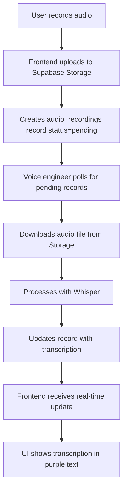

# Supabase Database Schema for Voice Recognition Integration

This document outlines the database schema needed for your voice engineer to integrate OpenAI Whisper transcription.

## Required Tables

### 1. `audio_recordings` Table

```sql
CREATE TABLE audio_recordings (
  id UUID PRIMARY KEY DEFAULT gen_random_uuid(),
  user_id TEXT NOT NULL,
  user_name TEXT NOT NULL,
  session_id TEXT,
  file_url TEXT NOT NULL,
  file_name TEXT NOT NULL,
  file_size INTEGER NOT NULL,
  duration REAL,
  created_at TIMESTAMPTZ DEFAULT NOW(),
  transcription_status TEXT DEFAULT 'pending' CHECK (transcription_status IN ('pending', 'processing', 'completed', 'failed')),
  transcription_text TEXT,
  transcription_confidence REAL,
  processing_started_at TIMESTAMPTZ,
  processing_completed_at TIMESTAMPTZ
);
```

### 2. `conversation_sessions` Table (Optional - for analytics)

```sql
CREATE TABLE conversation_sessions (
  id TEXT PRIMARY KEY,
  user_id TEXT NOT NULL,
  user_name TEXT NOT NULL,
  scenario_type TEXT DEFAULT 'default' CHECK (scenario_type IN ('default', 'custom')),
  scenario_description TEXT,
  started_at TIMESTAMPTZ DEFAULT NOW(),
  ended_at TIMESTAMPTZ,
  total_interactions INTEGER DEFAULT 0
);
```

## Indexes for Performance

```sql
-- Index for pending transcriptions (Whisper polling)
CREATE INDEX idx_audio_recordings_pending ON audio_recordings (transcription_status, created_at) 
WHERE transcription_status = 'pending';

-- Index for user's recordings
CREATE INDEX idx_audio_recordings_user ON audio_recordings (user_id, created_at DESC);

-- Index for session recordings
CREATE INDEX idx_audio_recordings_session ON audio_recordings (session_id, created_at);
```

## Row Level Security (RLS) Policies

```sql
-- Enable RLS
ALTER TABLE audio_recordings ENABLE ROW LEVEL SECURITY;
ALTER TABLE conversation_sessions ENABLE ROW LEVEL SECURITY;

-- Policy for users to access their own recordings
CREATE POLICY "Users can view their own recordings" ON audio_recordings
  FOR SELECT USING (user_id = current_setting('app.user_id', true));

-- Policy for the backend service to access all recordings (for Whisper processing)
CREATE POLICY "Backend service can access all recordings" ON audio_recordings
  FOR ALL USING (current_setting('app.service_role', true) = 'true');
```

## Real-time Subscriptions

Enable real-time for transcription updates:

```sql
-- Enable realtime for the table
ALTER PUBLICATION supabase_realtime ADD TABLE audio_recordings;
```

## Integration Points for Voice Engineer

### 1. Polling for New Audio Files

Your voice engineer can poll for new recordings to process:

```javascript
// Get pending transcriptions
const { data: pendingRecordings } = await supabase
  .from('audio_recordings')
  .select('*')
  .eq('transcription_status', 'pending')
  .order('created_at', { ascending: true });
```

### 2. Mark as Processing

When starting Whisper processing:

```javascript
// Mark as processing
await supabase
  .from('audio_recordings')
  .update({
    transcription_status: 'processing',
    processing_started_at: new Date().toISOString()
  })
  .eq('id', recordId);
```

### 3. Update with Transcription Result

After Whisper completes:

```javascript
// Update with transcription
await supabase
  .from('audio_recordings')
  .update({
    transcription_status: 'completed',
    transcription_text: whisperResult.text,
    transcription_confidence: whisperResult.confidence,
    processing_completed_at: new Date().toISOString()
  })
  .eq('id', recordId);
```

### 4. Handle Errors

If Whisper fails:

```javascript
// Mark as failed
await supabase
  .from('audio_recordings')
  .update({
    transcription_status: 'failed',
    processing_completed_at: new Date().toISOString()
  })
  .eq('id', recordId);
```

## Environment Variables Needed

Your voice engineer should set these in their environment:

```bash
# Supabase connection
SUPABASE_URL=your_supabase_url
SUPABASE_SERVICE_ROLE_KEY=your_service_role_key  # For backend access

# Whisper API (if using external service)
WHISPER_API_ENDPOINT=http://localhost:8000/transcribe
WHISPER_API_KEY=your_whisper_api_key

# Or OpenAI API (if using OpenAI's Whisper API)
OPENAI_API_KEY=your_openai_api_key
```

## Frontend Integration

The frontend automatically:

1. **Uploads audio** → Creates `audio_recordings` record with `status: 'pending'`
2. **Shows "Processing..."** → Placeholder text while waiting
3. **Subscribes to updates** → Real-time updates when transcription completes
4. **Updates UI** → Replaces "Processing..." with actual transcription

## Whisper Integration Workflow



## Testing the Integration

1. **Run the app** and record some audio
2. **Check Supabase** dashboard - you should see records in `audio_recordings` with `status: 'pending'`
3. **Your voice engineer** can query these records and process them
4. **When updated** with transcription, the frontend will automatically show the text

## File Structure for Voice Engineer

```
voice-service/
├── whisper_processor.py      # Main Whisper processing
├── supabase_client.py        # Supabase connection
├── audio_downloader.py       # Download audio from Storage
├── transcription_updater.py  # Update database with results
└── main.py                   # Polling loop or webhook handler
```

This setup ensures clean separation between frontend and voice processing, making integration seamless!
